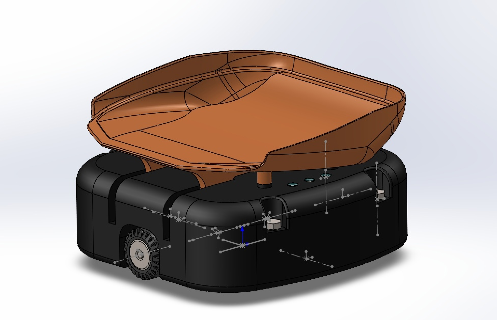

# __ROS line follower__

В данном проекте, представлена реализация двухколёсного мобильного робота сортировщика с дифференциальной кинематикой, перемещающегося вдоль линии. Робот оснащён механизмом для транспортировки и разгрузки грузов, а также видеокамерой для отслеживания линии.




## __Подготовка__
### __Необходимое программное обеспечение__

- ROS
- python

### __Установка__

Скопируйте наш репозиторий в свой `catkin_ws/src`

```
git clone https://github.com/shredr555/ITMO_sorter_project.git
```

## __Запуск__

Для запуска симуляции перейдите в `catkin_ws/src` и введите следующее

```
cd sorter_description/launch
roslaunch gazebo.launch
```

Для запуска алгоритма следования по линии также перейдите в `catkin_ws/src` и введите следующее

```
rosrun sorter_control simple_move.py
```